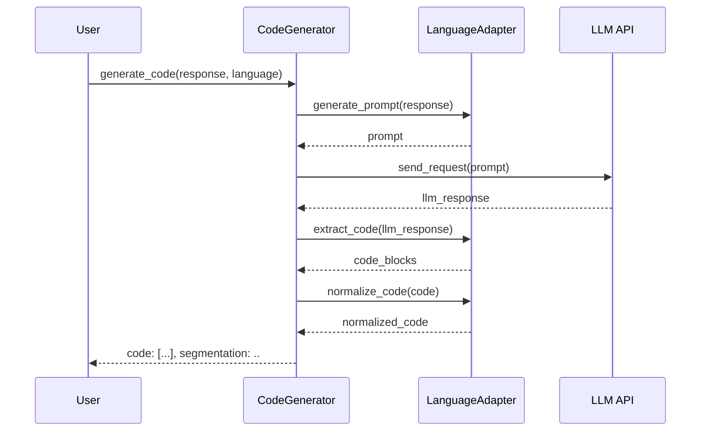
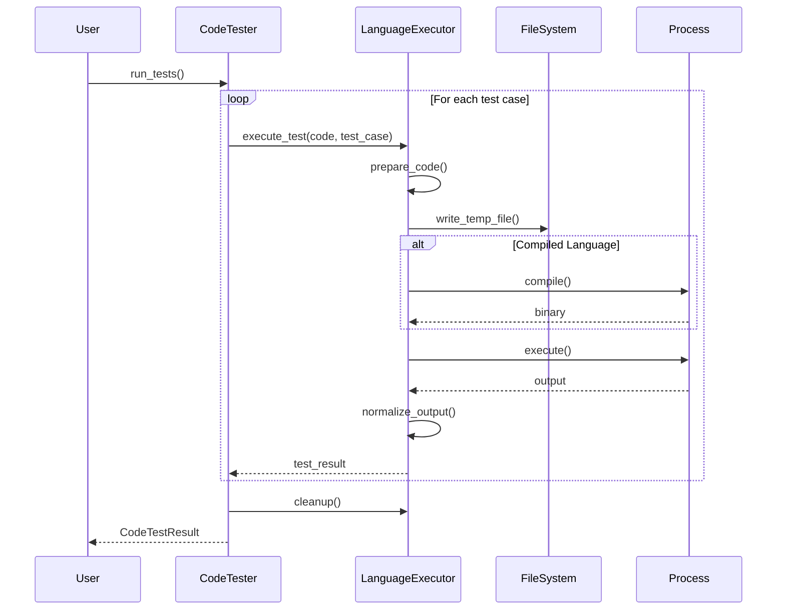
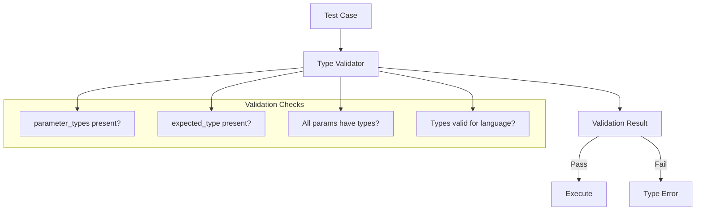
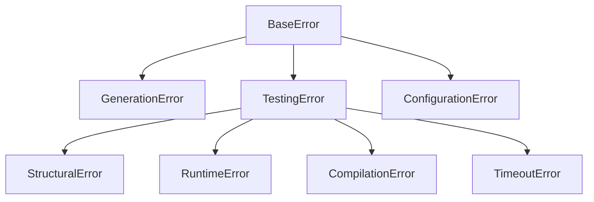
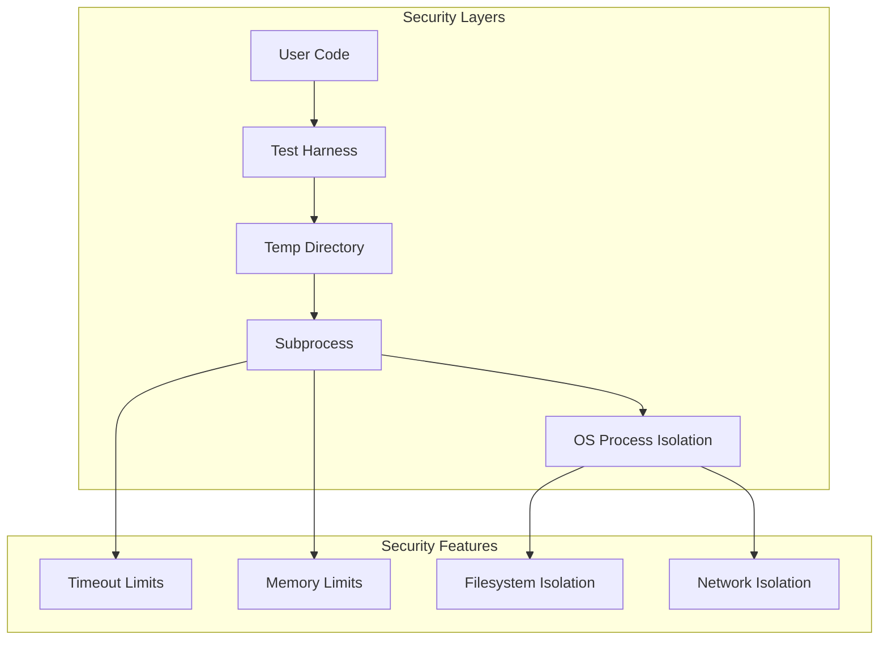
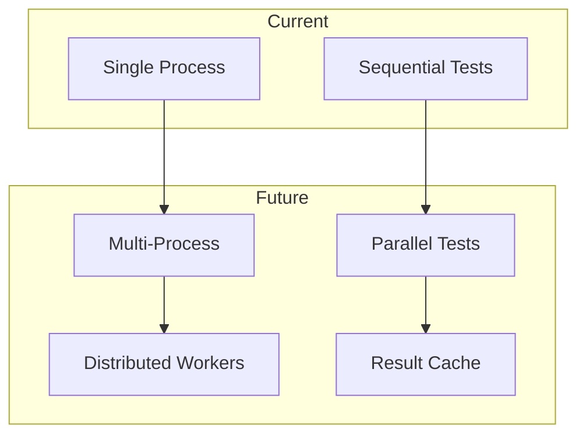

# Architecture Overview

Understanding the design and architecture of EiplGrader.

## System Architecture


## Core Design Principles

### 1. Separation of Concerns

The architecture strictly separates:
- **Code Generation** - Natural language to code transformation
- **Code Testing** - Execution and validation of generated code
- **Language Support** - Language-specific implementation details

### 2. Pluggable Architecture


### 3. Type System Flexibility

The system supports both:
- **Dynamic typing** with automatic inference (Python, JavaScript)
- **Static typing** with explicit annotations (Java, C++, Go, etc.)

## Component Details

### CodeGenerator

**Purpose**: Transform natural language descriptions into executable code using LLMs.

**Key Responsibilities**:
- LLM API communication
- Prompt engineering
- Multi-variant generation
- Code segmentation support

**Class Structure**:
```python
class CodeGenerator:
    def __init__(self, api_key: str, client_type: str = "openai", language: str = "python")
    def generate_code(self, student_response: str, **kwargs) -> Dict[str, Any]
    def _create_prompt(self, student_response: str, **kwargs) -> str
    def _parse_response(self, llm_response: str) -> Dict[str, Any]
```

### CodeTester

**Purpose**: Execute generated code against test cases and report results.

**Key Responsibilities**:
- Test case validation
- Language-specific execution
- Result aggregation
- Error handling

**Class Structure**:
```python
class CodeTester:
    def __init__(self, code: str, test_cases: List[Dict], function_name: str, language: str)
    def run_tests(self) -> Union[CodeTestResult, List[CodeTestResult]]
    def _validate_test_cases(self) -> None
    def _run_test(self, code: str) -> CodeTestResult
```

### Language System

The language system consists of three main components:

#### 1. Language Adapters

**Purpose**: Handle language-specific code generation requirements.

**Interface**:
```python
class LanguageAdapter(ABC):
    @abstractmethod
    def get_config(self) -> LanguageConfig
    
    @abstractmethod
    def generate_prompt(self, student_response: str, function_name: str, 
                       gen_type: str, **kwargs) -> str
    
    @abstractmethod
    def extract_code(self, llm_response: str) -> List[str]
    
    @abstractmethod
    def normalize_code(self, code: str) -> str
```

#### 2. Language Executors

**Purpose**: Handle language-specific code execution and testing.

**Interface**:
```python
class LanguageExecutor(ABC):
    @abstractmethod
    def prepare_code(self, code: str, test_case: Dict[str, Any]) -> str
    
    @abstractmethod
    def execute_test(self, code: str, test_case: Dict[str, Any]) -> Dict[str, Any]
    
    @abstractmethod
    def cleanup(self) -> None
```

#### 3. Language Registry

**Purpose**: Central registration and discovery of language support.

```python
class LanguageRegistry:
    def register(self, name: str, adapter: Type[LanguageAdapter]) -> None
                         executor: Type[LanguageExecutor]) -> None
    def get_adapter(self, language: str) -> LanguageAdapter
    def get_executor(self, language: str) -> LanguageExecutor
    def list_languages(self) -> List[str]
```

## Data Flow

### Code Generation Flow



### Code Testing Flow



## Type System Architecture

### Type Inference Pipeline (Dynamic Languages)

```mermaid
graph TB
    TV[Test Value<br/>e.g., 42]
    TI[Type Inferrer]
    TS[Type String<br/>e.g., "int"]
    TC[Test Case<br/>with Types]
    
    TV --> TI
    TI --> TS
    TS --> TC
    
    subgraph "Inference Rules"
        R1[isinstance int → "int"]
        R2[isinstance float → "double"]
        R3[isinstance str → "string"]
        R4[isinstance list → "List[T]"]
    end
    
    TI --> R1
    TI --> R2
    TI --> R3
    TI --> R4
```

### Type Validation Pipeline (Static Languages)



## Execution Models

### Interpreted Language Execution

```python
# Python/JavaScript execution model
class InterpretedLanguageExecutor:
    def execute_test(self, code, test_case):
        # 1. Infer/validate types
        test_case = self.validate_or_infer_types(test_case)
        
        # 2. Prepare code with test harness
        prepared_code = self.prepare_code(code, test_case)
        
        # 3. Write to temporary file
        temp_file = self.write_temp_file(prepared_code)
        
        # 4. Execute with interpreter
        result = subprocess.run([self.interpreter, temp_file])
        
        # 5. Parse output
        return self.parse_result(result.stdout)
```

### Compiled Language Execution

```python
# Java/C++/Go execution model
class CompiledLanguageExecutor:
    def execute_test(self, code, test_case):
        # 1. Validate types (required)
        self.validate_types_provided(test_case)
        
        # 2. Prepare code with embedded test values
        prepared_code = self.prepare_code(code, test_case)
        
        # 3. Write and compile
        source_file = self.write_source_file(prepared_code)
        binary = self.compile(source_file)
        
        # 4. Execute binary
        result = subprocess.run([binary])
        
        # 5. Parse output
        return self.parse_result(result.stdout)
```

## Error Handling Strategy

### Error Hierarchy



### Error Propagation

1. **Generation Phase**: Errors are caught and wrapped with context
2. **Testing Phase**: Errors are categorized (structural vs runtime)
3. **Result Phase**: Errors are included in test results with details

## Security Considerations

### Code Execution Isolation



### Security Best Practices

1. **Subprocess Isolation**: All code runs in separate processes
2. **Timeout Enforcement**: Configurable execution timeouts
3. **Temporary Files**: Cleaned up after execution
4. **No Network Access**: Generated code has no network capabilities


## Performance Considerations

### Optimization Points

1. **Parallel Test Execution**: Tests can run concurrently
2. **Executor Reuse**: Executors maintain state for efficiency
3. **Compilation Caching**: Compiled binaries can be cached
4. **LLM Response Caching**: Identical prompts can use cached responses

### Resource Management

```python
# Resource lifecycle
with CodeTester(code, test_cases) as tester:
    results = tester.run_tests()
    # Automatic cleanup on exit
```

## Extension Points

### Adding a New Language

1. Create adapter class inheriting from `LanguageAdapter`
2. Create executor class inheriting from appropriate base
3. Register with `LanguageRegistry`
4. Add tests and documentation

### Adding a New LLM Provider

1. Create provider class implementing `ModelRequest` interface
2. Add to `CodeGenerator` client types
3. Implement prompt formatting and response parsing

### Custom Test Runners

1. Extend `CodeTester` class
2. Override `_execute_single_test` method
3. Add custom result processing

## Future Architecture Considerations

### Planned Enhancements

1. **Distributed Execution**: Run tests across multiple machines
2. **Result Caching**: Cache test results for identical code
3. **Incremental Testing**: Only rerun affected tests
4. **Plugin System**: Dynamic loading of language support

### Scalability Patterns



## Next Steps

- Explore [Core Components](components/) for detailed implementation
- Learn about [Language System](languages/) for extension details
- See [API Reference](api/) for complete method documentation
- Review [Testing](testing.md) for quality assurance practices
