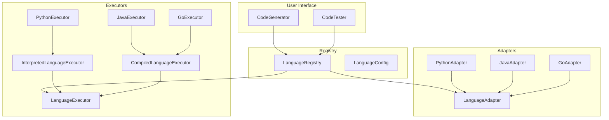

# Language System Architecture

Comprehensive guide to the language support system in EiplGrader.

## Overview

The language system provides a pluggable architecture for supporting multiple programming languages. It consists of three main components:

1. **Language Adapters** - Handle code generation specifics
2. **Language Executors** - Handle code execution and testing
3. **Language Registry** - Central registration and discovery

## Architecture Diagram



## Base Classes

### LanguageAdapter

The base class for all language adapters:

```python
from abc import ABC, abstractmethod
from typing import List, Dict, Any
from dataclasses import dataclass

@dataclass
class LanguageConfig:
    """Language configuration."""
    name: str
    display_name: str
    file_extensions: List[str]
    run_command: List[str]
    test_timeout: int = 30

class LanguageAdapter(ABC):
    """Abstract base class for language-specific code generation."""
    
    @abstractmethod
    def get_config(self) -> LanguageConfig:
        """Return language configuration."""
        pass
    
    @abstractmethod
    def generate_prompt(
        self,
        student_response: str,
        function_name: str,
        gen_type: str = "cgbg",
        num_to_gen: int = 1,
        **kwargs
    ) -> str:
        """Generate language-specific prompt for LLM."""
        pass
    
    @abstractmethod
    def extract_code(self, llm_response: str) -> List[str]:
        """Extract code blocks from LLM response."""
        pass
    
    @abstractmethod
    def normalize_code(self, code: str) -> str:
        """Normalize code format for consistency."""
        pass
```

### LanguageExecutor

The base class for all language executors:

```python
class LanguageExecutor(ABC):
    """Abstract base class for language-specific code execution."""
    
    @abstractmethod
    def prepare_code(self, code: str, test_case: Dict[str, Any]) -> str:
        """Prepare code for execution with test harness."""
        pass
    
    @abstractmethod
    def execute_test(self, code: str, test_case: Dict[str, Any]) -> Dict[str, Any]:
        """Execute code with test case and return results."""
        pass
    
    @abstractmethod
    def cleanup(self) -> None:
        """Clean up any temporary resources."""
        pass
    
    def validate_types_provided(self, test_case: Dict[str, Any]) -> None:
        """Validate required type information for static languages."""
        errors = []
        if "parameter_types" not in test_case:
            errors.append("parameter_types not provided")
        if "expected_type" not in test_case:
            errors.append("expected_type not provided")
        
        if errors:
            raise ValueError(f"Missing required type information: {errors}")
    
    def infer_type(self, value: Any) -> str:
        """Infer type from Python value (for dynamic languages)."""
        if isinstance(value, bool):
            return "bool"
        elif isinstance(value, int):
            return "int"
        elif isinstance(value, float):
            return "double"
        elif isinstance(value, str):
            return "string"
        elif isinstance(value, list):
            if value:
                element_type = self.infer_type(value[0])
                return f"List[{element_type}]"
            return "List"
        return "unknown"
```

## Specialized Base Classes

### InterpretedLanguageExecutor

For languages that run via interpreter:

```python
class InterpretedLanguageExecutor(LanguageExecutor):
    """Base executor for interpreted languages (Python, JavaScript)."""
    
    def __init__(self, interpreter_cmd: List[str], file_ext: str):
        self.interpreter_cmd = interpreter_cmd
        self.file_ext = file_ext
        self.temp_dir = tempfile.mkdtemp()
    
    def validate_or_infer_types(self, test_case: Dict[str, Any]) -> Dict[str, Any]:
        """Validate types if provided, or infer them from values."""
        # For interpreted languages, types are optional
        if "parameter_types" not in test_case:
            test_case["parameter_types"] = {}
        
        # Infer types for any missing parameter types
        for param_name, value in test_case.get("parameters", {}).items():
            if param_name not in test_case["parameter_types"]:
                test_case["parameter_types"][param_name] = self.infer_type(value)
        
        if "expected_type" not in test_case:
            test_case["expected_type"] = self.infer_type(test_case.get("expected"))
        
        return test_case
    
    def execute_test(self, code: str, test_case: Dict[str, Any]) -> Dict[str, Any]:
        """Execute test with interpreter."""
        # Prepare code with test harness
        prepared_code = self.prepare_code(code, test_case)
        
        # Write to temporary file
        code_path = os.path.join(self.temp_dir, f"test{self.file_ext}")
        with open(code_path, "w") as f:
            f.write(prepared_code)
        
        # Execute
        result = subprocess.run(
            self.interpreter_cmd + [code_path],
            capture_output=True,
            text=True,
            timeout=test_case.get("timeout", 30)
        )
        
        # Process result
        if result.returncode != 0:
            return {
                "passed": False,
                "error": result.stderr,
                "actual": None,
                "expected": test_case.get("expected")
            }
        
        # Parse output
        actual = self.normalize_output(result.stdout)
        passed = actual == test_case.get("expected")
        
        return {
            "passed": passed,
            "actual": actual,
            "expected": test_case.get("expected"),
            "output": result.stdout
        }
```

### CompiledLanguageExecutor

For languages that require compilation:

```python
class CompiledLanguageExecutor(LanguageExecutor):
    """Base executor for compiled languages (C, C++, Java, Go, Haskell)."""
    
    def __init__(
        self,
        compile_cmd: List[str],
        run_cmd: Optional[List[str]],
        file_ext: str,
        use_json_input: bool = False
    ):
        self.compile_cmd = compile_cmd
        self.run_cmd = run_cmd
        self.file_ext = file_ext
        self.use_json_input = use_json_input
        self.temp_dir = tempfile.mkdtemp()
    
    def compile(self, code_path: str) -> Tuple[bool, str, str]:
        """Compile code, return (success, output_path, error)."""
        output_path = code_path.replace(self.file_ext, "")
        cmd = self.compile_cmd + ["-o", output_path, code_path]
        
        result = subprocess.run(cmd, capture_output=True, text=True)
        return (result.returncode == 0, output_path, result.stderr)
    
    def execute_test(self, code: str, test_case: Dict[str, Any]) -> Dict[str, Any]:
        """Compile and execute test."""
        # Validate types are provided
        self.validate_types_provided(test_case)
        
        # Prepare code
        prepared_code = self.prepare_code(code, test_case)
        
        # Write to file
        code_path = os.path.join(self.temp_dir, f"test{self.file_ext}")
        with open(code_path, "w") as f:
            f.write(prepared_code)
        
        # Compile
        success, output_path, error = self.compile(code_path)
        if not success:
            return {
                "passed": False,
                "error": f"Compilation failed: {error}",
                "actual": None,
                "expected": test_case.get("expected")
            }
        
        # Execute
        result = subprocess.run(
            [output_path],
            capture_output=True,
            text=True,
            timeout=test_case.get("timeout", 30)
        )
        
        # Process result
        if result.returncode != 0:
            return {
                "passed": False,
                "error": f"Runtime error: {result.stderr}",
                "actual": None,
                "expected": test_case.get("expected")
            }
        
        # Parse output
        actual = self.normalize_output(result.stdout, test_case.get("expected_type"))
        passed = actual == test_case.get("expected")
        
        return {
            "passed": passed,
            "actual": actual,
            "expected": test_case.get("expected"),
            "output": result.stdout
        }
```

## Language Registry

Central registration system:

```python
class LanguageRegistry:
    """Central registry for language support."""
    
    def __init__(self):
        self._adapters: Dict[str, Type[LanguageAdapter]] = {}
        self._executors: Dict[str, Type[LanguageExecutor]] = {}
        self._initialize_languages()
    
    def _initialize_languages(self):
        """Register all supported languages."""
        # Python
        from .adapters.python_adapter import PythonAdapter
        from .executors.python_executor import PythonExecutor
        self.register_language("python", PythonAdapter, PythonExecutor)
        
        # JavaScript
        from .adapters.javascript_adapter import JavaScriptAdapter
        from .executors.javascript_executor import JavaScriptExecutor
        self.register_language("javascript", JavaScriptAdapter, JavaScriptExecutor)
        
        # Java
        from .adapters.java_adapter import JavaAdapter
        from .executors.java_executor import JavaExecutor
        self.register_language("java", JavaAdapter, JavaExecutor)
        
        # Add more languages...
    
    def register_language(
        self,
        name: str,
        adapter_class: Type[LanguageAdapter],
        executor_class: Type[LanguageExecutor]
    ) -> None:
        """Register a language with its adapter and executor."""
        self._adapters[name.lower()] = adapter_class
        self._executors[name.lower()] = executor_class
    
    def get_adapter(self, language: str) -> LanguageAdapter:
        """Get adapter instance for language."""
        if language.lower() not in self._adapters:
            raise ValueError(f"Unsupported language: {language}")
        return self._adapters[language.lower()]()
    
    def get_executor(self, language: str) -> LanguageExecutor:
        """Get executor instance for language."""
        if language.lower() not in self._executors:
            raise ValueError(f"Unsupported language: {language}")
        return self._executors[language.lower()]()
    
    def list_languages(self) -> List[str]:
        """List all supported languages."""
        return sorted(self._adapters.keys())
    
    def get_language_info(self, language: str) -> Dict[str, Any]:
        """Get detailed information about a language."""
        adapter = self.get_adapter(language)
        config = adapter.get_config()
        
        return {
            "name": config.name,
            "display_name": config.display_name,
            "file_extensions": config.file_extensions,
            "adapter_class": self._adapters[language.lower()].__name__,
            "executor_class": self._executors[language.lower()].__name__,
            "type_inference": self._supports_type_inference(language),
            "compilation_required": self._requires_compilation(language)
        }
    
    def _supports_type_inference(self, language: str) -> bool:
        """Check if language supports type inference."""
        executor_class = self._executors[language.lower()]
        return issubclass(executor_class, InterpretedLanguageExecutor)
    
    def _requires_compilation(self, language: str) -> bool:
        """Check if language requires compilation."""
        executor_class = self._executors[language.lower()]
        return issubclass(executor_class, CompiledLanguageExecutor)
```

## Implementation Patterns

### Adapter Implementation Pattern

```python
class NewLanguageAdapter(LanguageAdapter):
    """Adapter for NewLanguage support."""
    
    def get_config(self) -> LanguageConfig:
        return LanguageConfig(
            name="newlang",
            display_name="NewLanguage",
            file_extensions=[".nl"],
            run_command=["newlang"],
            test_timeout=30
        )
    
    def generate_prompt(self, student_response: str, **kwargs) -> str:
        """Generate NewLanguage-specific prompt."""
        gen_type = kwargs.get("gen_type", "cgbg")
        
        if gen_type == "cgbg":
            return f"""
Write a NewLanguage function that {student_response}.
The function should be named '{kwargs.get("function_name", "foo")}'.
Include only the function implementation.
"""
        else:
            # Handle other generation types
            pass
    
    def extract_code(self, llm_response: str) -> List[str]:
        """Extract NewLanguage code blocks."""
        import re
        
        # Look for code blocks
        patterns = [
            r"```newlang\n(.*?)\n```",
            r"```\n(.*?)\n```"
        ]
        
        for pattern in patterns:
            matches = re.findall(pattern, llm_response, re.DOTALL)
            if matches:
                return [match.strip() for match in matches]
        
        # Fallback to entire response
        return [llm_response.strip()]
    
    def normalize_code(self, code: str) -> str:
        """Normalize NewLanguage code."""
        # Remove comments
        lines = code.split('\n')
        normalized = []
        
        for line in lines:
            # Remove single-line comments
            if '//' in line:
                line = line[:line.index('//')]
            normalized.append(line.rstrip())
        
        return '\n'.join(normalized)
```

### Executor Implementation Pattern

```python
class NewLanguageExecutor(CompiledLanguageExecutor):
    """Executor for NewLanguage."""
    
    def __init__(self):
        super().__init__(
            compile_cmd=["newlangc"],
            run_cmd=["./a.out"],
            file_ext=".nl"
        )
    
    def prepare_code(self, code: str, test_case: Dict[str, Any]) -> str:
        """Prepare NewLanguage code with test harness."""
        function_name = test_case.get("function_name", "foo")
        parameters = test_case.get("parameters", {})
        parameter_types = test_case["parameter_types"]
        expected_type = test_case["expected_type"]
        
        # Build test harness
        harness = f"""
// Generated test harness
{code}

func main() {{
    // Initialize parameters
"""
        
        # Add parameter initialization
        for param_name, param_value in parameters.items():
            param_type = parameter_types[param_name]
            harness += f"    var {param_name} {param_type} = {self._format_value(param_value, param_type)}\n"
        
        # Add function call
        param_names = list(parameters.keys())
        harness += f"""
    // Call function
    result := {function_name}({', '.join(param_names)})
    
    // Output result
    print(result)
}}
"""
        return harness
    
    def _format_value(self, value: Any, type_str: str) -> str:
        """Format value for NewLanguage syntax."""
        if type_str == "string":
            return f'"{value}"'
        elif type_str == "[]int":
            return f"[{', '.join(map(str, value))}]"
        else:
            return str(value)
```

## Type System Integration

### Type Mapping

Each language needs type mappings:

```python
class TypeMapper:
    """Map generic types to language-specific types."""
    
    TYPE_MAPPINGS = {
        "python": {
            "int": "int",
            "double": "float",
            "string": "str",
            "bool": "bool",
            "List[int]": "List[int]",
            "List[string]": "List[str]"
        },
        "java": {
            "int": "int",
            "double": "double",
            "string": "String",
            "bool": "boolean",
            "List[int]": "int[]",
            "List[string]": "String[]"
        },
        "cpp": {
            "int": "int",
            "double": "double",
            "string": "std::string",
            "bool": "bool",
            "List[int]": "std::vector<int>",
            "List[string]": "std::vector<std::string>"
        }
        # Add more languages...
    }
    
    @classmethod
    def map_type(cls, generic_type: str, language: str) -> str:
        """Map generic type to language-specific type."""
        if language not in cls.TYPE_MAPPINGS:
            raise ValueError(f"No type mappings for language: {language}")
        
        mappings = cls.TYPE_MAPPINGS[language]
        return mappings.get(generic_type, generic_type)
```

### Type Validation

Validate types for a language:

```python
class TypeValidator:
    """Validate types for specific languages."""
    
    @staticmethod
    def validate_java_type(type_str: str) -> bool:
        """Validate Java type string."""
        valid_types = {
            "int", "double", "float", "long", "short", "byte",
            "boolean", "char", "String"
        }
        
        # Check basic types
        if type_str in valid_types:
            return True
        
        # Check array types
        if type_str.endswith("[]"):
            base_type = type_str[:-2]
            return TypeValidator.validate_java_type(base_type)
        
        # Check generic types (simplified)
        if "<" in type_str and ">" in type_str:
            return True  # Assume valid for now
        
        return False
```

## Testing Language Support

### Adapter Tests

```python
class TestLanguageAdapter(unittest.TestCase):
    """Test language adapter implementation."""
    
    def test_all_adapters_implement_interface(self):
        """Ensure all adapters implement required methods."""
        registry = LanguageRegistry()
        
        for language in registry.list_languages():
            adapter = registry.get_adapter(language)
            
            # Test required methods exist
            self.assertTrue(hasattr(adapter, 'get_config'))
            self.assertTrue(hasattr(adapter, 'generate_prompt'))
            self.assertTrue(hasattr(adapter, 'extract_code'))
            self.assertTrue(hasattr(adapter, 'normalize_code'))
            
            # Test config is valid
            config = adapter.get_config()
            self.assertIsInstance(config.name, str)
            self.assertIsInstance(config.file_extensions, list)
```

### Executor Tests

```python
class TestLanguageExecutor(unittest.TestCase):
    """Test language executor implementation."""
    
    def test_type_inference_languages(self):
        """Test languages with type inference."""
        registry = LanguageRegistry()
        inference_languages = ["python", "javascript"]
        
        for language in inference_languages:
            executor = registry.get_executor(language)
            
            # Test type inference
            test_case = {
                "parameters": {"x": 42},
                "expected": 84
            }
            
            # Should infer types
            if hasattr(executor, 'validate_or_infer_types'):
                result = executor.validate_or_infer_types(test_case)
                self.assertEqual(result["parameter_types"]["x"], "int")
                self.assertEqual(result["expected_type"], "int")
```

## Performance Considerations

### Executor Pooling

```python
class ExecutorPool:
    """Pool executors for reuse."""
    
    def __init__(self, max_executors: int = 10):
        self._pool: Dict[str, List[LanguageExecutor]] = {}
        self._max_executors = max_executors
    
    def acquire(self, language: str) -> LanguageExecutor:
        """Get an executor from the pool."""
        if language not in self._pool:
            self._pool[language] = []
        
        # Reuse existing executor if available
        if self._pool[language]:
            return self._pool[language].pop()
        
        # Create new executor
        registry = LanguageRegistry()
        return registry.get_executor(language)
    
    def release(self, language: str, executor: LanguageExecutor) -> None:
        """Return executor to pool."""
        if len(self._pool.get(language, [])) < self._max_executors:
            executor.cleanup()  # Clean but keep alive
            self._pool[language].append(executor)
```

### Compilation Caching

```python
class CompilationCache:
    """Cache compiled binaries."""
    
    def __init__(self, cache_dir: str = "/tmp/eiplgrader_cache"):
        self.cache_dir = cache_dir
        os.makedirs(cache_dir, exist_ok=True)
    
    def get_cache_path(self, code_hash: str, language: str) -> str:
        """Get cache path for compiled binary."""
        return os.path.join(self.cache_dir, f"{code_hash}.{language}")
    
    def is_cached(self, code_hash: str, language: str) -> bool:
        """Check if binary is cached."""
        return os.path.exists(self.get_cache_path(code_hash, language))
    
    def store(self, code_hash: str, language: str, binary_path: str) -> None:
        """Store compiled binary in cache."""
        cache_path = self.get_cache_path(code_hash, language)
        shutil.copy2(binary_path, cache_path)
```

## Next Steps

- Learn about [Adding New Languages](adding-languages.md)
- Explore [Language Executors](executors.md) in detail
- See [API Reference](../api/) for complete documentation
- Review [Testing Guide](../testing.md) for language testing