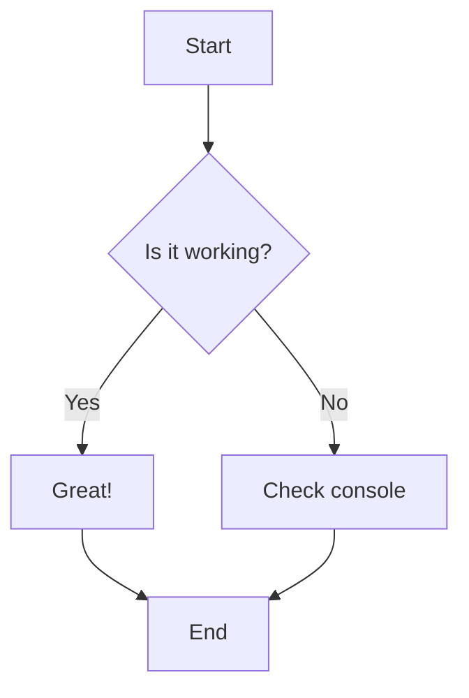
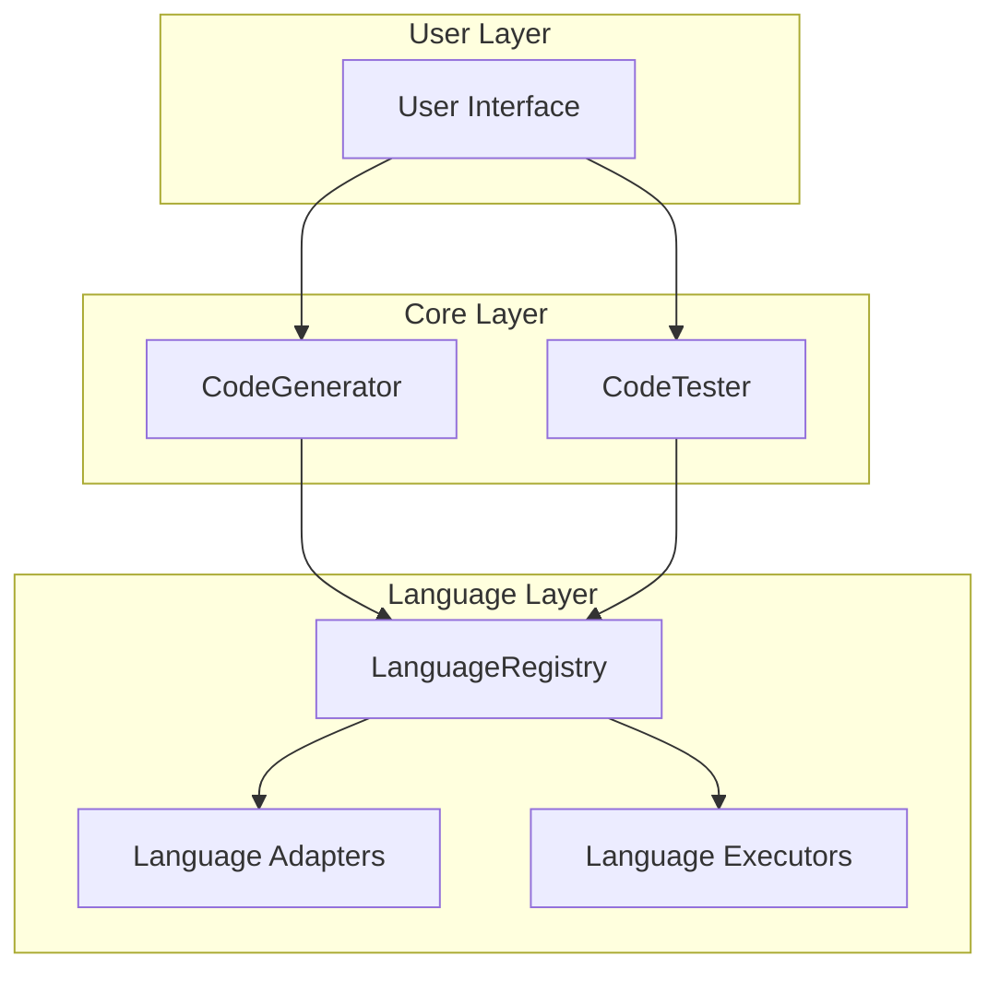
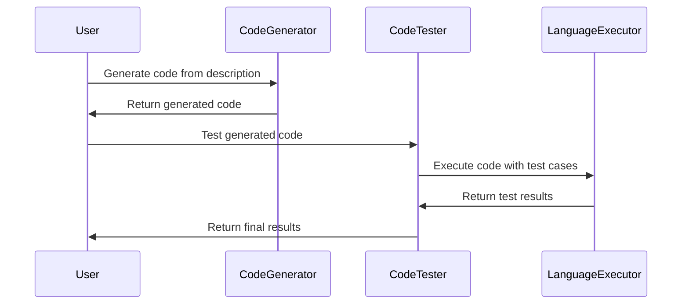

# Mermaid Diagram Test

This page tests if mermaid diagrams are working properly with improved accessibility.

## Features Tested

- ✅ **Diagram Rendering**: Converting code blocks to interactive diagrams
- ✅ **Accessibility**: ARIA labels, screen reader support, keyboard navigation
- ✅ **Responsive Design**: Diagrams scale properly on different screen sizes
- ✅ **High Contrast Support**: Better visibility for users with vision needs
- ✅ **Reduced Motion**: Respects user motion preferences

## Simple Flow Chart

This diagram shows a basic decision flow for testing mermaid functionality:

## Architecture Diagram

This diagram illustrates the layered architecture of the EiplGrader system:

## Sequence Diagram

This diagram shows the typical flow of operations:

## Accessibility Test

If you can see interactive, properly labeled diagrams above (instead of plain text code blocks), then:

- ✅ **Mermaid rendering is working correctly**
- ✅ **Accessibility features are enabled**
- ✅ **Screen readers can access diagram descriptions**
- ✅ **High contrast mode is supported**

### For Screen Reader Users

Each diagram includes:
- ARIA labels with diagram descriptions
- Hidden text alternatives with full diagram content
- Proper semantic structure with `role="img"`
- SVG titles and descriptions

### Keyboard Navigation

- Diagrams are focusable and have proper focus indicators
- Tab navigation works correctly around diagrams
- Focus management respects user preferences