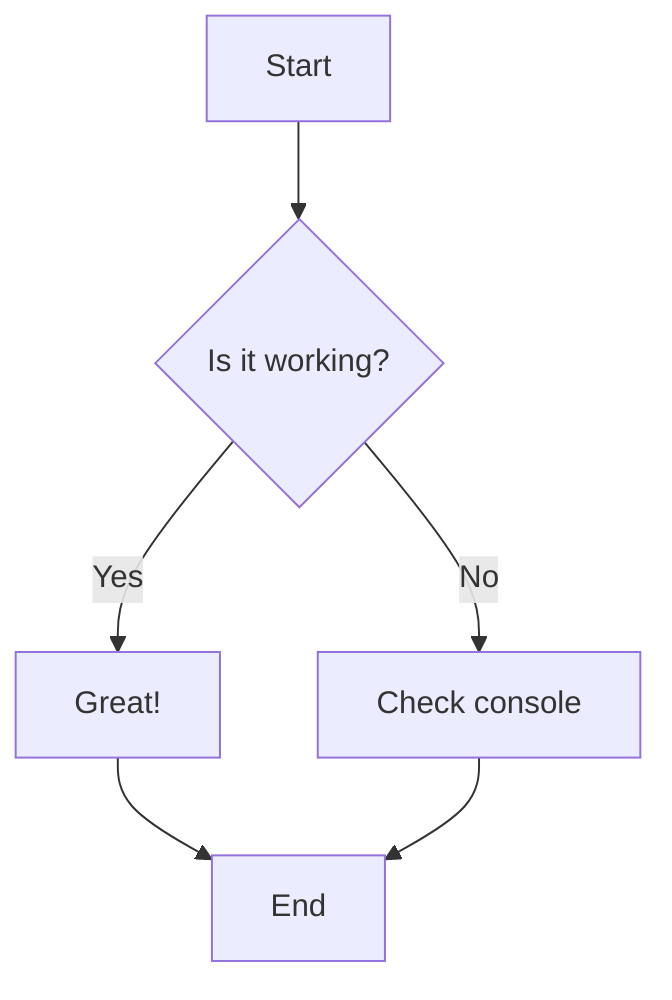
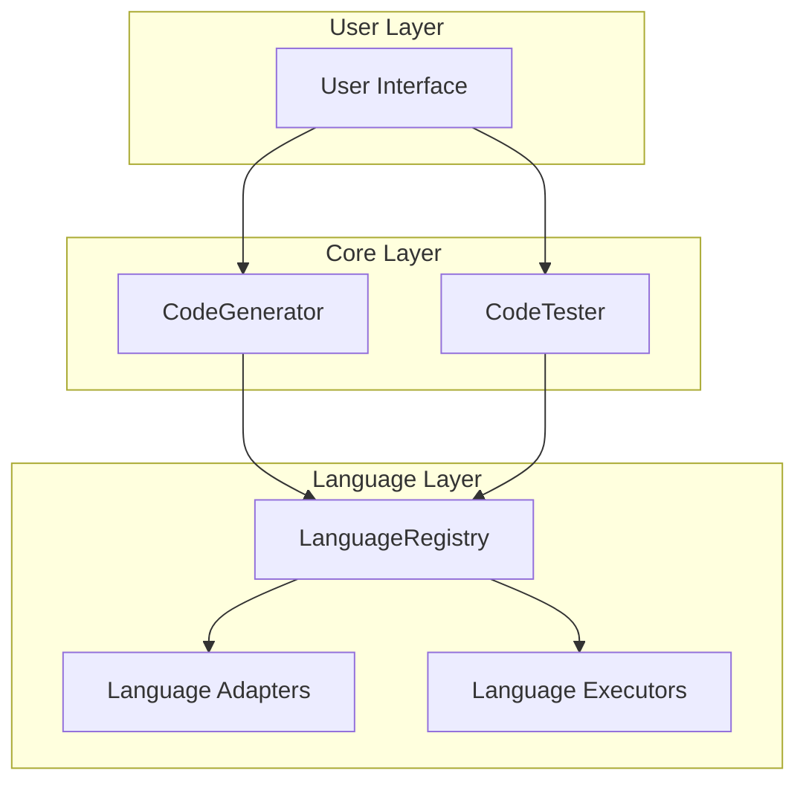

# Mermaid Diagram Test

This page tests if mermaid diagrams are working properly.

## Simple Flow Chart

## Architecture Diagram

If you can see interactive diagrams above instead of code blocks, mermaid is working correctly!